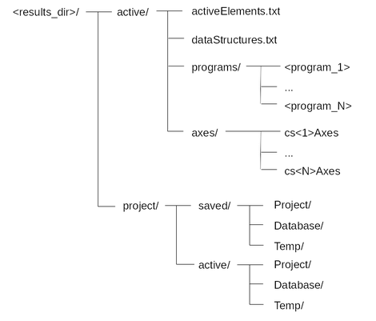
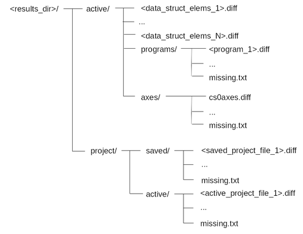

A tool to backup, compare and download the state of a PowerPMAC.

Installation
============

pipenv install 

Usage
=====

Help::

    dls-powerpmac-analyse -h

Launch GUI::

    dls-powerpmac-analyse -g

Command line options
--------------------
* ``--interface   <ip_address>:<port>``

    <ip_address> is the ip address of power pmac. 

    <port> is the port number on which to connect.

    Defaults to 192.168.56.10:1025

* ``--backup   <type>   <ignore_file>``

   ``<type>`` can be one of ``all``, ``active` or `project`` (Defaults to ``<type>=all``)

   * If ``active``, then only the active elements, buffered programs and coordinate system axes definitions are backed-up.
   * If ``project``, then only the saved and active Project files are backed-up.
   * If ``all``, then all of the above is backed-up.

   ``<ignore_file>`` (optional) is the path to the file listing which data structures should be ignored.

* ``--compare   <source_a>   <source_b>   <ignore_file>``

    ``<source_a>`` and ``<source_b>`` define the two sources to compare. They can take the form of a path to a back-up directory or a network interface ``<ip_address>:<port>``. This allows hardware-to-hardware, hardware-to-repository, or repository-to-repository comparison.

    ``<ignore_file>`` is the path to the file listing which data structures should be ignored.

* ``--resultsdir   <results_dir>``

    ``<results_dir>`` is the directory into which the backup or comparison files will be written. 

* ``--download   <project_dir>``

    ``<project_dir>`` is a local copy of the /var/ftp/usrflash/Project directory on a Power PMAC.

    Defaults to ./ppmacAnalyse.

* ``--recover   <usrflash_dir>``

    ``<usrflash_dir>`` is a local copy of the /opt/ppmac/usrflash directory on a Power PMAC.

Description
-----------
Backup
^^^^^^

The ``--backup`` option allows the user to read the active elements, buffered programs and coordinate system definitions and store their values locally, as well as copy saved and active Projects from the Power PMAC onto the local machine.

The structure of a backup directory is shown below. If ``<type>=active``, only the contents of the top level active directory is populated. If ``<type>=project``, only the contents of the top level project directory is populated. If ``<type>=all``, both directories are populated.

The contents of the various files and directories are as follows:

* active/ - contains the active configuration state of the Power PMAC.

* active/activeElements.txt - contains the list of active elements and their values.

* active/dataStructures.txt - contains the list of data structures found on the Power PMAC (column 1 of file), their group (column 2), their descriptions (column 3), and other data (remaining columns). The data structures listed correspond to sections *Power PMAC saved data structure elements, Power PMAC non-saved data structure elements and Power PMAC status data structure elements* of the software reference manual.

* active/programs/ - contains listings and metadata for the buffered programs and kinematics transforms.

* active/programs/<program_i> - contains program metadata returned from the Power PMAC ``gpascii`` buffer command in line 1, and the full program listing in the following lines for the program (or kinematic transform) named <program_i>.

* active/axes/ - contains axes definitions for all active coordinate systems.

* active/axes/cs<*i*>Axes - contains axis definitions for all axes assigned to coordinate system *i*.

* project/ - contains the saved and active Projects copied from the Power PMAC.

* project/saved/ - a local copy of the /opt/ppmac/usrflash directory on the Power PMAC.

* project/active/ - a local copy of the /var/ftp/usrflash directory on the Power PMAC.

To allow the dls_ppmacanalyse tool to backup all possible active elements would take days, as this would effectively equate to reading the entire Power PMAC registry space! Therefore a large number of data structures, for example ‘status’ and local program data structures, should be excluded from the analysis. The ignore file is used to specify which data structure elements should be excluded, and therefore not requested from the Power PMAC.

Given the data structures::

 A1[ ].A2[ ]
 A1[ ].A3
 A1[ ].A4[ ].A5
 A1[ ].A6.A7
 A1[ ].A6.A8

and the ignore list::

 A1[3:]
 A1[ ].A2[1:]
 A1[0:].A3
 A1[ ].A4[2:].A5
 A1[1:].A6.A7

We expect the following conditions to be fulfilled:

1. All data structures belonging to A1[i] will be ignored for i >= 3

2. The structure A2[j] belonging to A1[i] will be ignored for i >= 3 (as per condition 1) and j >= 1

3. The structure A3 belonging to A1[i] will be ignored for i >= 0

4. The structure A5 belonging to A1[i].A4[j] will be ignored for i >= 3 (as per condition 1) and j >= 2

5. The data structure A7 belonging to A1[i].A6 will be ignored for i >= 1

6. The data structure A8 belonging to A1[i].A6 will be ignored for i >= 3 (as per condition 1)

The resulting data structure elements that will not be ignored (i.e. they will be read from the PPMAC) are therefore::

 A1[0].A2[0]
 A1[1].A2[0]
 A1[2].A2[0]
 A1[0].A4[0].A5
 A1[0].A4[1].A5
 A1[1].A4[0].A5
 A1[1].A4[1].A5
 A1[2].A4[0].A5
 A1[2].A4[1].A5
 A1[0].A6.A7
 A1[0].A6.A8
 A1[1].A6.A8
 A1[2].A6.A8

Individual indices to ignore can be specified, e.g. ``A1[6]``, ``A1[7]``, ``A1[8]``, ``A1[10]``, as can ranges of indices, e.g. ``A1[6:8]`` which will ignore indices 6 through 8 inclusive.

Download
^^^^^^^^

The ``--download`` option copies the specified built project into the active project site of the Power PMAC (/var/ftp/usrflash/Project) and then loads it into active memory using the ``projpp`` command. Unlike the IDE, which copies only a subset of local Project files onto the Power PMAC, here the entire contents of /var/ftp/usrflash/Project on the Power PMAC is deleted and replaced with the contents of the local Project directory <project_dir>. It is therefore important that the local Project is complete in order for ``projpp`` to succeed (for example, projpp will fail if a pp_save.tpl does not exist). It is also important that the Project has been built, for example by using the IDE, prior to the download. To ensure these conditions are satisfied it is recommended that the local Project is one that has been taken from a working Power PMAC, e.g. by issuing a ``--backup`` command.

Example use::

$ dls_ppmacanalyse   --download   <backup_dir>/project/active

 where ``<backup_dir>`` is the results directory of a backup command.

Recover
^^^^^^^

The ``--recover`` option can be used to restore a previous saved configuration in the same way the recovery stick method does. Project, Database and Temp directories which have been copied from the /opt/ppmac/usrflash site on the Power PMAC are copied back into that site, and the Project will become active upon power cycling the Power PMAC.

Example use::

$ dls_ppmacanalyse   --recover   <backup_dir>/project/saved

 where <backup_dir> is the results directory of a backup command.

Compare
^^^^^^^

The ``--compare`` option can be used to perform a comparison of both the active state and Project files for either two real Power PMACs, a real Power PMAC and a backup repository, or two different backup repositories.

Example 1, comparison of two real Power PMACs::

$ dls_ppmacanalyse   --compare   <ip address 1>:<port 1>   <ip address 2>:<port 2>

 where ``<ip_address_1>:<port_1>`` and ``<ip_address_2>:<port_2>`` specify the IP addresses and ports of the two real Power PMACs.

Example 2, comparison of a real Power PMAC with the contents of a repository::

$ dls_ppmacanalyse   --compare   <ip_address_1>:<port_1>   <backup_dir>

where ``<ip address 1>:<port 1>`` specifies the IP address and port of the real Power PMAC, and ``<backup_dir>`` is the path to the top level of a backup directory, for example the ``<results_dir>`` specified when a backup command is executed.

The structure of the files and directories created from a comparison is shown below.

The contents of the files and directories listed above is as follows:

* active/ - contains the differences in the active configuration state between the two Power PMAC sources (real Power PMAC or backup repository).

* active/<data_struct_elems_i>.diff - contains the differences in the active data structures between the two Power PMAC sources.

* active/programs/ - contains the differences in the buffered programs between the two Power PMAC sources.

* active/programs/<program_i>.diff - contains line-by-line differences in the buffered program <program_i> between the two Power PMAC sources, if it exists in both sources.

* active/programs/missing.txt - contains the full listing of any programs that were missing from either source.

* active/axes/ - contains the differences in coordinate system axes definitions between the two Power PMAC sources.

* active/axes/cs<i>axes.diff - contains the line-by-line differences in axes definitions for coordinate system i between the two Power PMAC sources.

* active/axes/missing.txt - contains coordinate system definitions for any coordinate systems that were found missing from either source.

* project/ - contains the differences in both the active and saved project file directories between the two Power PMAC sources.

* project/saved/ - contains a linux-style recursive diff between the saved project directories of the two sources, i.e. /opt/ppmac/usrflash/Project for a real Power PMAC, and <results_dir>/project/saved/Project for a backup repository.

* project/active/ - contains a linux-style recursive diff between the active project directories of the two sources, i.e. /var/ftp/usrflash/Project for a real Power PMAC, and <results_dir>/project/active/Project for a backup repository.
